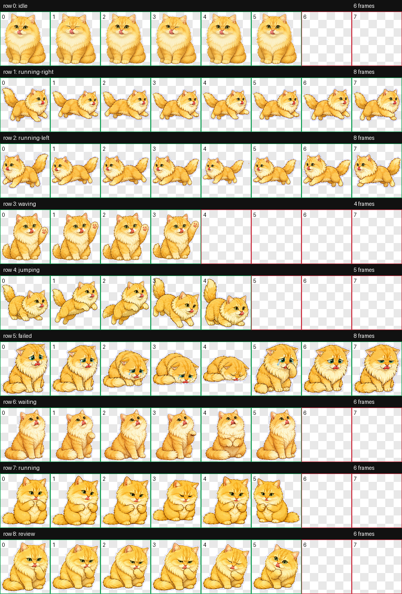
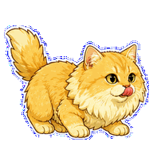

# 舔舔猫 - 我的金渐层小伙伴

[English README](README.md)

> 一个可以在 Codex 编辑器里养猫的小宠物插件：把我家快 5 岁的金渐层搬进屏幕，让写代码的每一天都有猫猫陪伴。



## 灵感来源

他是一只**金渐层**，也是一只马上就要 **5 岁**的小朋友。因为实在太喜欢他了，我干脆用代码给他捏了一个可爱的数字分身，让他能随时趴在编辑器里陪我敲代码。

现在每次打开 Codex，第一眼就能看到他那张毛茸茸的小脸，治愈感直接拉满。

## 动作预览

| 状态 | 预览 |
| --- | --- |
| 待机 |  |
| 向右移动 |  |
| 向左移动 |  |
| 挥爪 |  |
| 跳跃 |  |
| 失败 |  |
| 等待 |  |
| 处理中 |  |
| 复查 |  |

## 文件结构

```text
.
├── pet.json
├── spritesheet.webp
├── install.sh
├── install.ps1
├── README.md
├── README.zh-CN.md
└── qa/
    ├── contact-sheet.png
    └── previews/
        ├── idle.gif
        ├── running-right.gif
        ├── running-left.gif
        ├── waving.gif
        ├── jumping.gif
        ├── failed.gif
        ├── waiting.gif
        ├── running.gif
        └── review.gif
```

## 安装

### macOS / Linux

```bash
curl -fsSL https://raw.githubusercontent.com/0xNekoo/licky-cat-codex-pet/main/install.sh | bash
```

### Windows PowerShell

```powershell
iwr -UseB https://raw.githubusercontent.com/0xNekoo/licky-cat-codex-pet/main/install.ps1 | iex
```

安装后重启 Codex，然后在自定义宠物列表里选择 `舔舔猫`。

## 验证

macOS / Linux：

```bash
PET_DIR="${CODEX_HOME:-$HOME/.codex}/pets/licky-cat"
test -f "$PET_DIR/pet.json"
test -f "$PET_DIR/spritesheet.webp"
python3 -m json.tool "$PET_DIR/pet.json" >/dev/null
```

Windows PowerShell：

```powershell
$CodexHome = if ($env:CODEX_HOME) { $env:CODEX_HOME } else { Join-Path $env:USERPROFILE ".codex" }
$PetDir = Join-Path (Join-Path $CodexHome "pets") "licky-cat"
Test-Path (Join-Path $PetDir "pet.json")
Test-Path (Join-Path $PetDir "spritesheet.webp")
Get-Content (Join-Path $PetDir "pet.json") | ConvertFrom-Json | Out-Null
```

`pet.json` 应包含：

```json
{
  "id": "licky-cat",
  "displayName": "舔舔猫",
  "spritesheetPath": "spritesheet.webp"
}
```

## 卸载

macOS / Linux：

```bash
rm -rf "${CODEX_HOME:-$HOME/.codex}/pets/licky-cat"
```

Windows PowerShell：

```powershell
$CodexHome = if ($env:CODEX_HOME) { $env:CODEX_HOME } else { Join-Path $env:USERPROFILE ".codex" }
Remove-Item -Recurse -Force (Join-Path (Join-Path $CodexHome "pets") "licky-cat")
```

卸载后重启 Codex。
